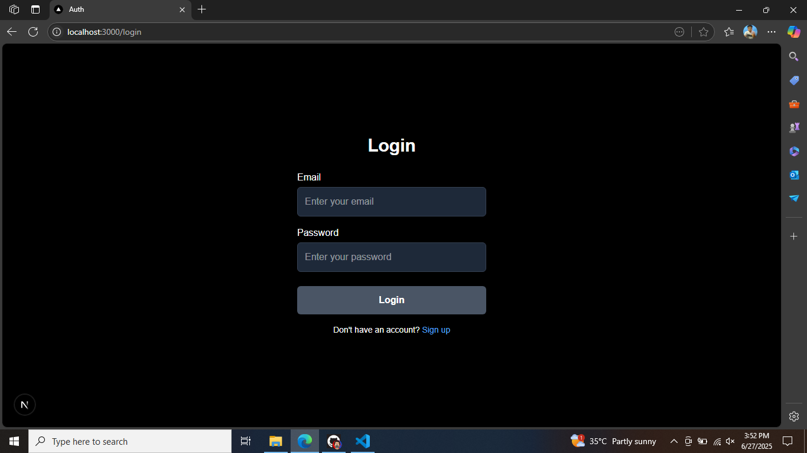
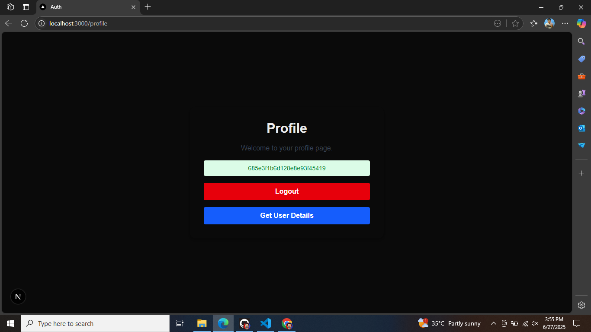

# 🔐 Authentication System

A secure and modern authentication system built using NEXTJS. This project provides a complete user auth flow including registration, login, email verification, and secure session/token management.

---

## 📸 Demo




> Replace `demo.jpg` with your actual screenshot file.

---

## 🚀 Features

- ✅ User Registration & Login  
- 📧 Email Verification  
- 🔐 Secure Authentication (JWT/Session-based)  
- 🔄 Password Reset Flow *(optional)*  
- 🔒 Protected Routes  
- 🎭 Role-based Access Control *(optional)*  
- 🧪 Built with modern technologies

---

## 🛠 Tech Stack

- **Frontend:** [React / Next.js / Tailwind CSS]  
- **Backend:** [Node.js / Express]  
- **Database:** [MongoDB / PostgreSQL]  
- **Auth:** [JWT / NextAuth.js / Firebase Auth]

> Replace with your actual stack.

---

## 📦 Getting Started

### 1. Clone the Repository

```bash
git clone https://github.com/your-username/auth-system.git
cd auth-system
